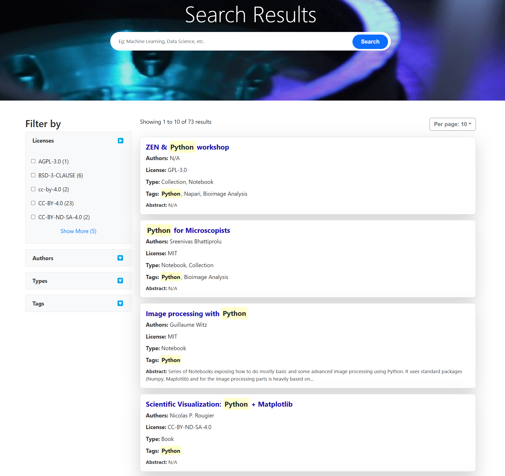
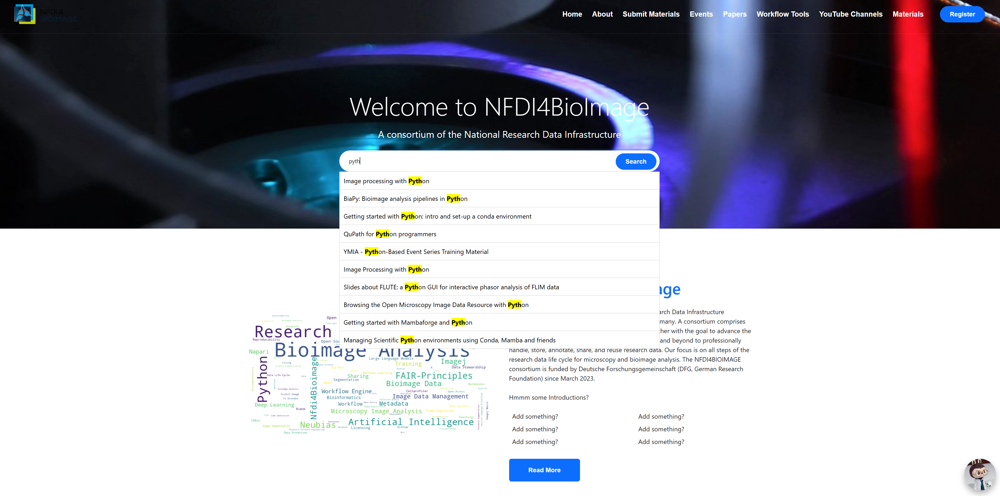
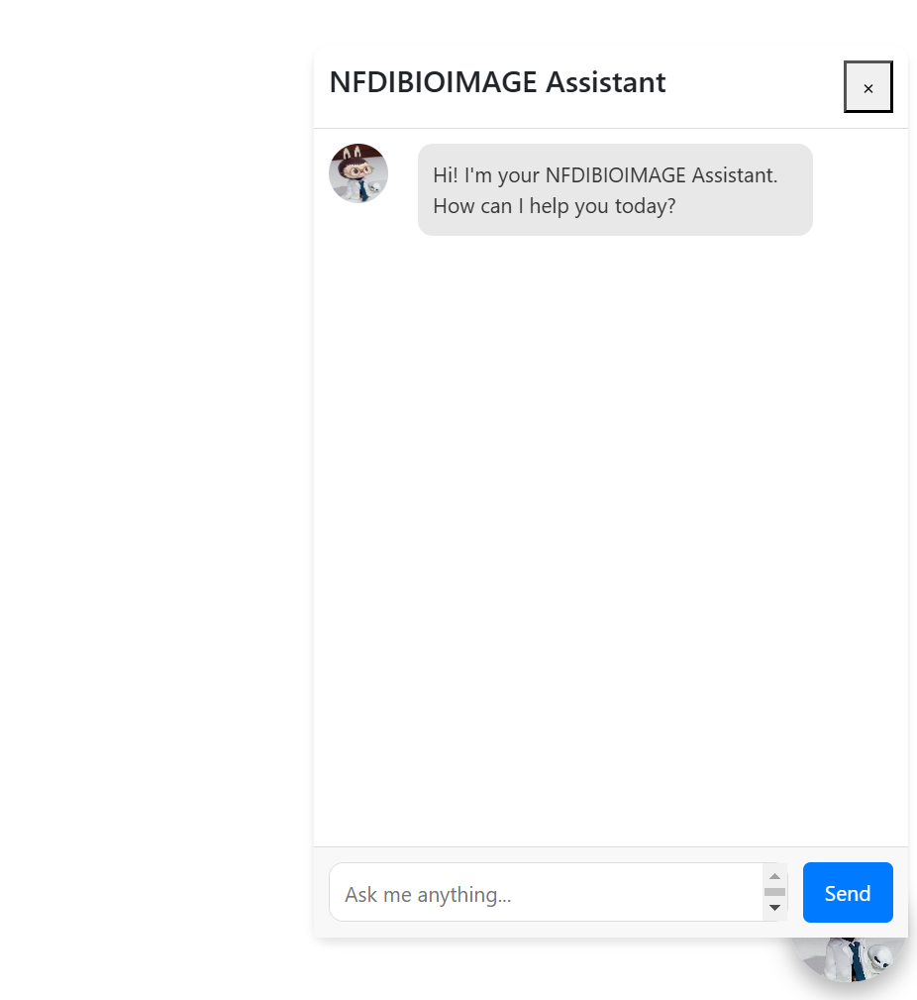
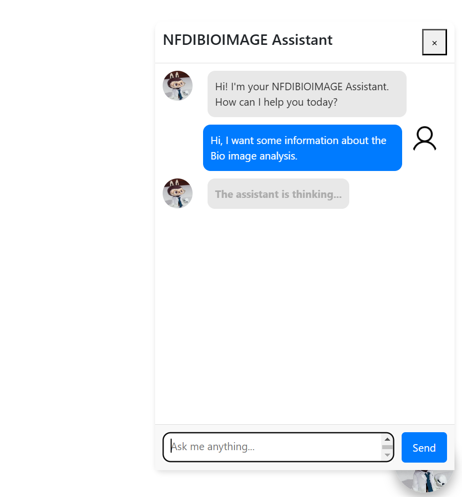

# NFDI Search Engine

This repository is dedicated to enhancing the search functionality of the NFDI4BioImage training website by collecting and organizing training materials and related resources.

## Overview

The project leverages several key technologies:

- **[Elasticsearch](https://www.elastic.co/guide/en/elasticsearch/reference/current/index.html)**: For indexing and searching materials.
- **[React](https://react.dev/learn)**: As the frontend framework for building a user-friendly interface.
- **[Flask](https://flask.palletsprojects.com/en/latest/)**: Serving as the backend API to manage interactions with the database and Elasticsearch.
- **[Scroll API](https://www.elastic.co/guide/en/elasticsearch/reference/current/scroll-api.html)**: Used to efficiently handle large datasets during search queries.
- **[NFDIBIOIMAGE Assistant](https://scads.github.io/generative-ai-notebooks/20_chatbots/10_chatbot.html)**: Helps researchers find relevant resources.
- **[KISSKI LLM](https://scads.github.io/generative-ai-notebooks/15_endpoint_apis/06_kisski_endpoint.html)**: Powers intelligent chatbot responses.
- **[Retrieval Augmented Generation](https://scads.github.io/generative-ai-notebooks/60_rag/20-simple-rag.html)**: Provides context-aware answers.

## Quick Start with Docker

To simplify the setup process, the project is containerized with Docker. Follow these steps to get the search engine up and running on your local machine.

### Prerequisites

1. **GitHub API Key or Token**: The search engine requires access to GitHub for submitting and managing materials. Ensure that you have set up the necessary GitHub API keys or tokens on your machine.
   - You can refer to this [website](https://nfdi4bioimage.github.io/training/contributing/submit_app.html) for instructions on how to set up the API key or token.
   - This key/token should be securely stored and added to the necessary environment variables on your machine.

2. **KISSKI API Key**: To enable the NFDIBIOIMAGE Assistant to interact with the KISSKI LLM service, you need to configure your KISSKI API key. Follow these steps to set it up:

   #### Step 1: Obtain a KISSKI API Key
    - Visit the official KISSKI LLM service page: [KISSKI LLM Service](https://services.kisski.de/services/en/?service=2-02-llm-service.json).
    - Register or log in to access the service.
    - Once registered, generate your **KISSKI API key** from the email.

   #### Step 2: Set Up the API Key in the Project
    - Open the project directory in your preferred code editor.
    - Locate the `.env` file in the root of the project. If the file doesn't exist, create a new one.
    - Replace `your_kisski_api_key_here` with the API key you obtained from KISSKI in your `.env` file:
        ```plaintext
        KISSKI_API_KEY=your_kisski_api_key_here
        ```
    - Save the `.env` file.

3. **[Docker](https://www.docker.com/)** and **[Docker Compose](https://docs.docker.com/compose/install/)** installed on your machine.

4. **Currently, this project is only supported on Windows.**

### Setup Instructions

1. Clone the repository:
   ```bash
   git clone https://github.com/NFDI4BIOIMAGE/nfdi_search_engine.git
   ```
   ```bash
   cd nfdi_search_engine
   ```

2. Locate the `docker-compose.yml` file in the project directory.

3. Build and start the containers:
   ```bash
   docker-compose up --build
   ```

This command will pull all necessary images, build the project, and start the containers.

4. **Important**: After the initial setup, when you start the containers again by clicking the **Start** button in Docker Desktop, you will need to wait approximately **37 seconds** for Elasticsearch and the Chatbot's LLM service to fully initialize before the search engine and chatbot become accessible.


## Accessing the Application

Once the Docker containers are running, you can access the application:

1. **Search Engine Interface**: Visit 'http://localhost:3000' to access the search engine. You’ll find a user-friendly interface that allows you to search and browse a variety of training materials related to bioimage analysis.

  

  

2. **Real-Time Search Suggestions**: As you type in the search bar, real-time search suggestions will appear, helping you quickly locate relevant materials. The suggestions provide specific document titles based on your query, making it easier to find exactly what you need.

  

3. **View All Training Materials**: Explore all available training materials in the Materials section, where resources are displayed in a paginated, organized format. Use the filters on the left to sort materials by Authors, Tags, Types, and Licenses to refine your search results further.

  

4. **Submit Materials**: Contribute to the platform by submitting new training materials through the Submit Materials page. Navigate to 'http://localhost:3000/' submit-materials and complete the form to add your content. Fields marked with * are required, while fields labeled as "Optional" can be filled in at your discretion.

  

5. **NFDIBIOIMAGE Assistant**: Click the floating chatbot icon at the bottom-right corner of the homepage to interact with the NFDIBIOIMAGE Assistant.

  

  - Type your question or keyword in the chat box.

  

  - Within seconds, the assistant will provide suggestions and links to relevant materials for instant access.

  

## Features

- **Search Engine**: Find all the current training materials available on the NFDI4BioImage training website with easy-to-use search functionality.
  

- **Material Submission**: A streamlined process for collecting and managing training materials via the submission portal.


- **Chatbot Assistant**: Interact with the intelligent assistant to get quick answers, suggestions, and relevant material links for your queries.


## Contributing

If you'd like to contribute to the project, feel free to open an issue or submit a pull request.


