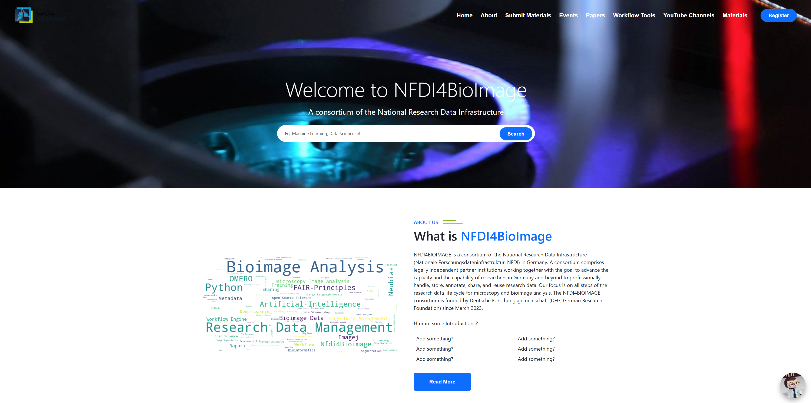

# NFDI Search Engine

This repository is dedicated to enhancing the search functionality of the NFDI4BioImage training website by collecting and organizing training materials and related resources.

## Overview

The project leverages several key technologies:

- **[Elasticsearch](https://www.elastic.co/guide/en/elasticsearch/reference/current/index.html)**: For indexing and searching materials.
- **[React](https://react.dev/learn)**: As the frontend framework for building a user-friendly interface.
- **[Flask](https://flask.palletsprojects.com/en/latest/)**: Serving as the backend API to manage interactions with the database and Elasticsearch.
- **[Scroll API](https://www.elastic.co/guide/en/elasticsearch/reference/current/scroll-api.html)**: Used to efficiently handle large datasets during search queries.


## Quick Start with Docker

To simplify the setup process, the project is containerized with Docker. Follow these steps to get the search engine up and running on your local machine.

### Prerequisites

1. **GitHub API Key or Token**: The search engine requires access to GitHub for submitting and managing materials. Ensure that you have set up the necessary GitHub API keys or tokens on your machine.
   - You can refer to this [website](https://nfdi4bioimage.github.io/training/contributing/submit_app.html) for instructions on how to set up the API key or token.
   - This key/token should be securely stored and added to the necessary environment variables on your machine.

2. - [Docker](https://www.docker.com/) and [Docker Compose](https://docs.docker.com/compose/install/) installed on your machine.

3. - **Currently, this project is only supported on Windows.**

### Setup Instructions

1. Clone the repository:
   ```bash
   git clone https://github.com/NFDI4BIOIMAGE/nfdi_search_engine.git
   ```
   ```bash
   cd nfdi_search_engine
   ```

2. Locate the `docker-compose.yml` file in the project directory.

3. Build and start the containers:
   ```bash
   docker-compose up --build
   ```

This command will pull all necessary images, build the project, and start the containers.

4. **Important**: After the initial setup, when you start the containers again by clicking the **Start** button in Docker Desktop, you will need to wait approximately **22 seconds** for Elasticsearch to fully initialize before the search engine becomes accessible.


## Accessing the Application

Once the Docker containers are running, you can access the application:

1. **Search Engine Interface**: Visit the website on `http://localhost:3000` to use the search engine. You'll see a user-friendly interface where you can search and explore the available training materials. Here's a preview of how the search engine looks:

  

  

2. **Submit Materials**: The project also includes a **material submission** platform that makes it easy for users to contribute new training materials. Simply visit `http://localhost:3000/submit-materials` and follow the instructions to upload new content.

  


## Features

- **Search Engine**: Find all the current training materials available on the NFDI4BioImage training website with easy-to-use search functionality.
  

- **Material Submission**: A streamlined process for collecting and managing training materials via the submission portal.


## Contributing

If you'd like to contribute to the project, feel free to open an issue or submit a pull request.


